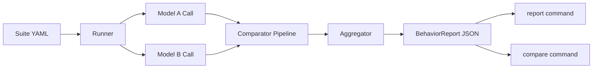

# llm-behavior-diff

Deterministic behavioral regression testing for LLM model upgrades.

`llm-behavior-diff` runs the same suite against two model versions, classifies behavioral differences, and highlights upgrade risk before production rollout.


Current release baseline: **GA v1.0.0**.

## At A Glance

| Capability | Status | Notes |
| --- | --- | --- |
| Deterministic comparator pipeline | Implemented | semantic, factual, format, behavioral |
| Optional LLM-as-judge | Implemented | metadata-only, never overrides final decision |
| Statistical significance (bootstrap + Wilson + permutation) | Implemented | run metadata + compare delta rows |
| Risk-tier gate policies | Implemented | strict, balanced, permissive for CLI and CI |
| Artifact benchmark quality pack | Implemented | advisory-only benchmark summaries from report JSONs |
| CI release checks | Implemented | quality, build/twine, regression workflow |

## Why This Exists

Upgrading from one model version to another can silently change behavior:

- factual reliability can drift
- formatting/instruction compliance can break
- safety boundaries can shift
- output style can change while semantics stay equivalent

Ad-hoc prompt checks miss these patterns and are hard to reproduce in CI.

## Who This Is For

- LLM platform teams shipping model upgrades
- Application teams with safety/format requirements
- MLOps teams needing upgrade gates with machine-readable reports

## What You Get

- Comparator-first deterministic diffing (`semantic`, `factual`, `format`, `behavioral`)
- Optional external factual validation (`--factual-connector wikipedia`, metadata-only)
- Single-suite run command with retry/rate-limit/cost controls
- JSON report artifacts for CI and governance workflows
- Report rendering in `table`, `json`, `markdown`, `csv`, `ndjson`, `junit`, and interactive self-contained `html`
- Optional direct export connectors for rendered reports (`--export-connector http|s3|gcs|bigquery|snowflake|redshift|azure_blob|databricks|postgres`)
- Run-to-run compare command with delta metrics + bootstrap CI + permutation p-value + effect size + FDR
- Policy gate command for deterministic release decisions (`strict|balanced|permissive`)
- Advisory benchmark command for report artifacts (`llm-diff benchmark`) with extended significance summary

## Installation

```bash
pip install llm-behavior-diff
```

Requires Python 3.11+.

## Getting Started

### 1) Set provider keys

```bash
export OPENAI_API_KEY=sk-...
export ANTHROPIC_API_KEY=sk-ant-...
export LLM_DIFF_LOCAL_BASE_URL=http://localhost:11434/v1
# optional:
# export LLM_DIFF_LOCAL_API_KEY=local-api-key
# export LLM_DIFF_EXPORT_API_KEY=export-api-key
# export AWS_ACCESS_KEY_ID=...
# export AWS_SECRET_ACCESS_KEY=...
# export AWS_SESSION_TOKEN=...   # optional
# export GOOGLE_APPLICATION_CREDENTIALS=/path/to/gcp-service-account.json  # optional ADC
# export AZURE_CLIENT_ID=...      # optional DefaultAzureCredential chain input
# export AZURE_TENANT_ID=...      # optional DefaultAzureCredential chain input
# export AZURE_CLIENT_SECRET=...  # optional DefaultAzureCredential chain input
# export LLM_DIFF_EXPORT_SF_PASSWORD=...  # optional Snowflake export password
# export LLM_DIFF_EXPORT_RS_PASSWORD=...  # optional Redshift export password
# export LLM_DIFF_EXPORT_DBX_TOKEN=...    # optional Databricks PAT token
# export LLM_DIFF_EXPORT_PG_PASSWORD=...  # optional PostgreSQL export password
```

### 2) Create a suite

```yaml
name: quick_suite
description: Basic regression checks
version: "1.0"
metadata:
  owner: llm-platform

test_cases:
  - id: q_001
    prompt: "Return valid JSON with keys name and age."
    category: instruction_following
    tags: [json, format]
    expected_behavior: Must return parseable JSON with name and age keys
    max_tokens: 256
    temperature: 0.0
    metadata:
      priority: high
```

### 3) Validate the suite

```bash
llm-diff run \
  --model-a gpt-4o \
  --model-b gpt-4.5 \
  --suite quick_suite.yaml \
  --dry-run
```

### 4) Run the comparison

```bash
llm-diff run \
  --model-a gpt-4o \
  --model-b gpt-4.5 \
  --suite quick_suite.yaml \
  --factual-connector wikipedia \
  --factual-connector-timeout 8 \
  --factual-connector-max-results 3 \
  --max-workers 4 \
  --max-retries 3 \
  --rate-limit-rps 2 \
  --output run_report.json
```

### 5) Render a report

```bash
llm-diff report run_report.json --format table
llm-diff report run_report.json --format html -o run_report.html
llm-diff report run_report.json --format csv -o run_report.csv
llm-diff report run_report.json --format ndjson -o run_report.ndjson
llm-diff report run_report.json --format junit -o run_report.junit.xml
llm-diff report run_report.json --format csv -o run_report.csv \
  --export-connector http --export-endpoint https://example.com/ingest
llm-diff report run_report.json --format ndjson -o run_report.ndjson \
  --export-connector s3 --export-s3-bucket my-llm-diff-bucket \
  --export-s3-prefix team-a/exports --export-s3-region eu-west-1
llm-diff report run_report.json --format markdown -o run_report.md \
  --export-connector gcs --export-gcs-bucket my-llm-diff-bucket \
  --export-gcs-prefix team-a/exports --export-gcs-project analytics-prj
llm-diff report run_report.json --format ndjson -o run_report.ndjson \
  --export-connector bigquery \
  --export-bq-project analytics-prj \
  --export-bq-dataset llm_diff \
  --export-bq-table diff_rows \
  --export-bq-location EU
llm-diff report run_report.json --format ndjson -o run_report.ndjson \
  --export-connector snowflake \
  --export-sf-account xy12345.eu-west-1 \
  --export-sf-user svc_llm_diff \
  --export-sf-warehouse COMPUTE_WH \
  --export-sf-database ANALYTICS_DB \
  --export-sf-schema LLM_DIFF \
  --export-sf-table DIFF_ROWS
llm-diff report run_report.json --format ndjson -o run_report.ndjson \
  --export-connector redshift \
  --export-rs-host redshift-cluster.example.amazonaws.com \
  --export-rs-port 5439 \
  --export-rs-database analytics \
  --export-rs-user svc_llm_diff \
  --export-rs-schema llm_diff \
  --export-rs-table diff_rows \
  --export-rs-sslmode require
llm-diff report run_report.json --format markdown -o run_report.md \
  --export-connector azure_blob \
  --export-az-account-url https://myaccount.blob.core.windows.net \
  --export-az-container llm-diff-exports \
  --export-az-prefix team-a/exports
llm-diff report run_report.json --format ndjson -o run_report.ndjson \
  --export-connector databricks \
  --export-dbx-host dbc-123.cloud.databricks.com \
  --export-dbx-http-path /sql/1.0/endpoints/abc123 \
  --export-dbx-catalog main \
  --export-dbx-schema llm_diff \
  --export-dbx-table diff_rows
llm-diff report run_report.json --format ndjson -o run_report.ndjson \
  --export-connector postgres \
  --export-pg-host postgres.example.com \
  --export-pg-port 5432 \
  --export-pg-database analytics \
  --export-pg-user svc_llm_diff \
  --export-pg-schema llm_diff \
  --export-pg-table diff_rows \
  --export-pg-sslmode require
```

### 6) Compare two runs

```bash
llm-diff compare previous_run.json candidate_run.json
llm-diff compare previous_run.json candidate_run.json -o comparison.md
```

### 7) Evaluate risk-tier gate policy

```bash
llm-diff gate candidate_run.json --policy strict
llm-diff gate candidate_run.json --policy balanced --format json -o gate_result.json
```

### 8) Build benchmark quality summary (advisory-only)

```bash
llm-diff benchmark run_report.json --format table
llm-diff benchmark previous_run.json candidate_run.json --format markdown -o benchmark.md
```

## How It Works

1. Load and validate one suite YAML.
2. Resolve providers from model prefixes:
   - `gpt-*`, `o1-*`, `o3-*` -> OpenAI
   - `claude-*` -> Anthropic
   - `litellm:<model_ref>` -> LiteLLM
   - `local:<model_ref>` -> Local OpenAI-compatible endpoint
3. Execute each test with model A and B concurrently.
4. Apply deterministic comparators:
   - `semantic`: semantic equivalence gate
   - `factual`: hallucination/knowledge-change rules
   - optional `factual_external`: connector-backed factual evidence signal (metadata-only)
   - `format`: structure/constraint compliance checks
   - `behavioral`: expected-behavior coverage deltas
   - optional `judge`: LLM-as-judge on semantic diffs (metadata-only)
5. Aggregate with fixed precedence:
   - `semantic-same > factual > format > behavioral > unknown`
6. Emit `BehaviorReport` with diffs, category stats, token usage, and estimated cost.
   - judge outputs never override deterministic final category/regression flags



## Decision Snapshot

```text
run output:
- regressions: 7 (CI: [4.0%, 13.0%])
- improvements: 3 (CI: [1.0%, 8.0%])

compare output:
- regression delta CI: [+2.1, +9.4] pp
- regression delta significant?: yes
```

## Why This Over Ad-Hoc Evals

- Deterministic rules keep regression signals explainable.
- Comparator breakdowns are persisted in report metadata.
- CI workflows can gate upgrades on explicit regression counts.
- One command surface keeps local and CI execution aligned.

## Adoption Checklist

- Define domain suites with explicit `expected_behavior` terms.
- Start with `--dry-run` in CI for suite validation.
- Enable retry/rate-limit defaults for provider stability.
- Track `regressions`, `failed_tests`, and estimated cost in artifacts.
- Gate upgrades with multi-suite runs in `model-upgrade-regression.yml`.
- Use `llm-diff gate` locally with the same policy tier used in CI.

## Built-In Suites

- `suites/general_knowledge.yaml`
- `suites/instruction_following.yaml`
- `suites/safety_boundaries.yaml`
- `suites/coding_tasks.yaml`
- `suites/reasoning.yaml`

## CLI Summary

### `llm-diff run`

Core flags:

- `--model-a`, `--model-b`, `--suite`, `--output`
- `--dry-run`
- `--continue-on-error`
- `--max-workers`, `--max-retries`, `--rate-limit-rps`
- `--pricing-file`
- `--judge-model` (optional metadata-only LLM judge)
- `--factual-connector` (`none|wikipedia`, default `none`)
- `--factual-connector-timeout` (default `8.0`)
- `--factual-connector-max-results` (default `3`)

### `llm-diff report`

Render one run report as `table | json | html | markdown | csv | ndjson | junit`.
Optional direct export connectors:
- HTTP: `--export-connector http --export-endpoint ...`
- S3: `--export-connector s3 --export-s3-bucket ... [--export-s3-prefix ...] [--export-s3-region ...]`
- GCS: `--export-connector gcs --export-gcs-bucket ... [--export-gcs-prefix ...] [--export-gcs-project ...]` (ADC auth)
- Azure Blob: `--export-connector azure_blob --export-az-account-url ... --export-az-container ... [--export-az-prefix ...]` (DefaultAzureCredential auth, all non-table formats)
- BigQuery (NDJSON only): `--export-connector bigquery --format ndjson --export-bq-project ... --export-bq-dataset ... --export-bq-table ... [--export-bq-location ...]`
- Snowflake (NDJSON only): `--export-connector snowflake --format ndjson --export-sf-account ... --export-sf-user ... --export-sf-warehouse ... --export-sf-database ... --export-sf-schema ... --export-sf-table ... [--export-sf-role ...]` (`--export-sf-password` or `LLM_DIFF_EXPORT_SF_PASSWORD`)
- Redshift (NDJSON only): `--export-connector redshift --format ndjson --export-rs-host ... --export-rs-port 5439 --export-rs-database ... --export-rs-user ... --export-rs-schema ... --export-rs-table ... [--export-rs-sslmode ...]` (`--export-rs-password` or `LLM_DIFF_EXPORT_RS_PASSWORD`)
- Databricks SQL (NDJSON only): `--export-connector databricks --format ndjson --export-dbx-host ... --export-dbx-http-path ... --export-dbx-catalog ... --export-dbx-schema ... --export-dbx-table ...` (`--export-dbx-token` or `LLM_DIFF_EXPORT_DBX_TOKEN`)
- PostgreSQL (NDJSON only): `--export-connector postgres --format ndjson --export-pg-host ... --export-pg-port 5432 --export-pg-database ... --export-pg-user ... --export-pg-schema ... --export-pg-table ... [--export-pg-sslmode ...]` (`--export-pg-password` or `LLM_DIFF_EXPORT_PG_PASSWORD`)
- Export resilience contract: transient connector errors are retried automatically (`max_attempts=3`, backoff `0.5s`, `1.0s` + bounded jitter), and unresolved failures remain fail-fast.

### `llm-diff compare`

Compare two run reports and print/write metric deltas, bootstrap CI, permutation p-values, effect size (Cohen's h), and FDR-adjusted significance.

### `llm-diff gate`

Evaluate one run report with deterministic policy tiers:

- `strict`: regressions must be `0`
- `balanced`: low regression budget + critical-category hard-fail
- `permissive`: wider budget + targeted critical-category limits
- `--policy-pack`: `core` (default), `risk_averse`, `velocity`
- `--policy-file`: optional custom YAML policy file (`version: v1`) that overrides pack selection for that run

### `llm-diff benchmark`

Builds artifact-first benchmark quality summaries from one or more report JSON files.

- `llm-diff benchmark <report_json...> --format table|json|markdown`
- advisory-only output (does not affect gate pass/fail)
- includes extended significance summary (effect size + BH-FDR) when report metadata is available
- fixed checks include failed tests, critical factual/safety regressions, unknown-rate, and runtime outliers

## Release & CI

- `ci.yml`: quality checks on `master` push + PR (`ruff`, `black --check`, `mypy`, `pytest`)
- `release-check.yml`: build/twine/wheel smoke checks
- `publish-pypi.yml`: manual TestPyPI/PyPI publish flow
- `docker-image.yml`: PR/master build+smoke, optional manual GHCR push
- `model-upgrade-regression.yml`: manual/reusable regression gate (`gate_policy`, `gate_policy_pack`, optional `gate_policy_file`; optional factual connector inputs; default `strict + core`) + per-suite export artifacts (`csv`, `ndjson`, `junit`) + optional direct export connectors (`http|s3|gcs|bigquery|snowflake|redshift|azure_blob|databricks|postgres`; `gcs`, `redshift`, `azure_blob`, `databricks`, and `postgres` values are env-based via repo vars/secrets)
- `model-upgrade-regression.yml` also emits always-on benchmark artifacts (`artifacts/benchmark/benchmark.json`, `artifacts/benchmark/benchmark.md`) from generated suite report JSONs
- Node24 deprecation closure: workflows keep `FORCE_JAVASCRIPT_ACTIONS_TO_NODE24=true` and now run on Node24-ready major action pins.
- Workflow security hardening: all third-party actions are pinned to full commit SHAs; Dependabot auto-updates `github-actions` minor/patch versions weekly, while major bumps are handled in planned maintenance windows.

Local parity commands:

```bash
make install-dev
make ci-local
make release-local
```

Full operational steps and secret matrix are in [docs/release-runbook.md](docs/release-runbook.md).

## Documentation

- [Docs Home](docs/index.md)
- [Quick Start](docs/quickstart.md)
- [CLI Reference](docs/cli-reference.md)
- [Suite Reference](docs/suite-reference.md)
- [Architecture](docs/architecture.md)
- [API Reference](docs/api-reference.md)
- [Release Runbook](docs/release-runbook.md)
- [Launch Kit](docs/launch-kit/devto.md)

## Current Scope and Future Exploration

Implemented now:

- deterministic comparator pipeline
- optional LLM-as-judge (metadata-only, opt-in)
- optional external factual connector (`wikipedia`, metadata-only, opt-in)
- retry/rate-limit/cost tracking
- bootstrap + Wilson confidence intervals (run metadata)
- bootstrap delta CI + permutation p-value + effect size + FDR (compare rows)
- risk-tier gate policies (CLI + model-upgrade workflow)
- artifact-first benchmark quality pack (advisory-only, with extended significance summary)
- enterprise-ready report export artifacts (`csv`, `ndjson`, `junit`)
- optional direct export connectors (`http`, `s3`, `gcs`, `bigquery`, `snowflake`, `redshift`, `azure_blob`, `databricks`, `postgres`; `gcs`/`azure_blob` support all non-table formats, `bigquery`/`snowflake`/`redshift`/`databricks`/`postgres` are NDJSON-only)
- export connector reliability hardening (transient retries with fail-fast final semantics)
- suite templates and CI distribution workflows

Committed roadmap status:

- No open committed roadmap items at this time.

Future exploration candidates (not committed yet):

- additional provider-specific external sinks beyond the current set (`http`, `s3`, `gcs`, `bigquery`, `snowflake`, `redshift`, `azure_blob`, `databricks`, `postgres`)

## Contributing

See [CONTRIBUTING.md](CONTRIBUTING.md).

## License

MIT
