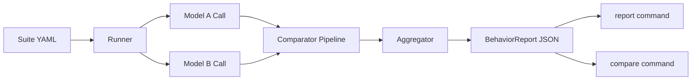

# llm-behavior-diff

Deterministic behavioral regression testing for LLM model upgrades.

`llm-behavior-diff` runs the same suite against two model versions, classifies behavioral differences, and highlights upgrade risk before production rollout.


## At A Glance

| Capability | Status | Notes |
| --- | --- | --- |
| Deterministic comparator pipeline | Implemented | semantic, factual, format, behavioral |
| Optional LLM-as-judge | Implemented | metadata-only, never overrides final decision |
| Statistical significance (bootstrap CI) | Implemented | run metadata + compare delta rows |
| CI release checks | Implemented | quality, build/twine, regression workflow |

## Why This Exists

Upgrading from one model version to another can silently change behavior:

- factual reliability can drift
- formatting/instruction compliance can break
- safety boundaries can shift
- output style can change while semantics stay equivalent

Ad-hoc prompt checks miss these patterns and are hard to reproduce in CI.

## Who This Is For

- LLM platform teams shipping model upgrades
- Application teams with safety/format requirements
- MLOps teams needing upgrade gates with machine-readable reports

## What You Get

- Comparator-first deterministic diffing (`semantic`, `factual`, `format`, `behavioral`)
- Single-suite run command with retry/rate-limit/cost controls
- JSON report artifacts for CI and governance workflows
- Report rendering in `table`, `json`, `html`, `markdown`
- Run-to-run compare command with delta metrics

## Installation

```bash
pip install llm-behavior-diff
```

Requires Python 3.11+.

## Getting Started

### 1) Set provider keys

```bash
export OPENAI_API_KEY=sk-...
export ANTHROPIC_API_KEY=sk-ant-...
```

### 2) Create a suite

```yaml
name: quick_suite
description: Basic regression checks
version: "1.0"
metadata:
  owner: llm-platform

test_cases:
  - id: q_001
    prompt: "Return valid JSON with keys name and age."
    category: instruction_following
    tags: [json, format]
    expected_behavior: Must return parseable JSON with name and age keys
    max_tokens: 256
    temperature: 0.0
    metadata:
      priority: high
```

### 3) Validate the suite

```bash
llm-diff run \
  --model-a gpt-4o \
  --model-b gpt-4.5 \
  --suite quick_suite.yaml \
  --dry-run
```

### 4) Run the comparison

```bash
llm-diff run \
  --model-a gpt-4o \
  --model-b gpt-4.5 \
  --suite quick_suite.yaml \
  --max-workers 4 \
  --max-retries 3 \
  --rate-limit-rps 2 \
  --output run_report.json
```

### 5) Render a report

```bash
llm-diff report run_report.json --format table
llm-diff report run_report.json --format html -o run_report.html
```

### 6) Compare two runs

```bash
llm-diff compare previous_run.json candidate_run.json
llm-diff compare previous_run.json candidate_run.json -o comparison.md
```

## How It Works

1. Load and validate one suite YAML.
2. Resolve providers from model prefixes:
   - `gpt-*`, `o1-*`, `o3-*` -> OpenAI
   - `claude-*` -> Anthropic
3. Execute each test with model A and B concurrently.
4. Apply deterministic comparators:
   - `semantic`: semantic equivalence gate
   - `factual`: hallucination/knowledge-change rules
   - `format`: structure/constraint compliance checks
   - `behavioral`: expected-behavior coverage deltas
   - optional `judge`: LLM-as-judge on semantic diffs (metadata-only)
5. Aggregate with fixed precedence:
   - `semantic-same > factual > format > behavioral > unknown`
6. Emit `BehaviorReport` with diffs, category stats, token usage, and estimated cost.
   - judge outputs never override deterministic final category/regression flags



## Decision Snapshot

```text
run output:
- regressions: 7 (CI: [4.0%, 13.0%])
- improvements: 3 (CI: [1.0%, 8.0%])

compare output:
- regression delta CI: [+2.1, +9.4] pp
- regression delta significant?: yes
```

## Why This Over Ad-Hoc Evals

- Deterministic rules keep regression signals explainable.
- Comparator breakdowns are persisted in report metadata.
- CI workflows can gate upgrades on explicit regression counts.
- One command surface keeps local and CI execution aligned.

## Adoption Checklist

- Define domain suites with explicit `expected_behavior` terms.
- Start with `--dry-run` in CI for suite validation.
- Enable retry/rate-limit defaults for provider stability.
- Track `regressions`, `failed_tests`, and estimated cost in artifacts.
- Gate upgrades with multi-suite runs in `model-upgrade-regression.yml`.

## Built-In Suites

- `suites/general_knowledge.yaml`
- `suites/instruction_following.yaml`
- `suites/safety_boundaries.yaml`
- `suites/coding_tasks.yaml`
- `suites/reasoning.yaml`

## CLI Summary

### `llm-diff run`

Core flags:

- `--model-a`, `--model-b`, `--suite`, `--output`
- `--dry-run`
- `--continue-on-error`
- `--max-workers`, `--max-retries`, `--rate-limit-rps`
- `--pricing-file`
- `--judge-model` (optional metadata-only LLM judge)

### `llm-diff report`

Render one run report as `table | json | html | markdown`.

### `llm-diff compare`

Compare two run reports and print/write metric deltas.

## Release & CI

- `ci.yml`: quality checks on `master` push + PR (`ruff`, `black --check`, `mypy`, `pytest`)
- `release-check.yml`: build/twine/wheel smoke checks
- `publish-pypi.yml`: manual TestPyPI/PyPI publish flow
- `docker-image.yml`: PR/master build+smoke, optional manual GHCR push
- `model-upgrade-regression.yml`: manual/reusable regression gate (fails on any regression)

Full operational steps and secret matrix are in [docs/release-runbook.md](docs/release-runbook.md).

## Documentation

- [Docs Home](docs/index.md)
- [Quick Start](docs/quickstart.md)
- [CLI Reference](docs/cli-reference.md)
- [Suite Reference](docs/suite-reference.md)
- [Architecture](docs/architecture.md)
- [API Reference](docs/api-reference.md)
- [Release Runbook](docs/release-runbook.md)
- [Launch Kit](docs/launch-kit/devto.md)

## Limits and Planned Work

Implemented now:

- deterministic comparator pipeline
- optional LLM-as-judge (metadata-only, opt-in)
- retry/rate-limit/cost tracking
- bootstrap significance/confidence intervals (metadata-only + compare rows)
- suite templates and CI distribution workflows

Planned:

- extended statistical testing beyond bootstrap CI (future)

## Contributing

See [CONTRIBUTING.md](CONTRIBUTING.md).

## License

MIT
